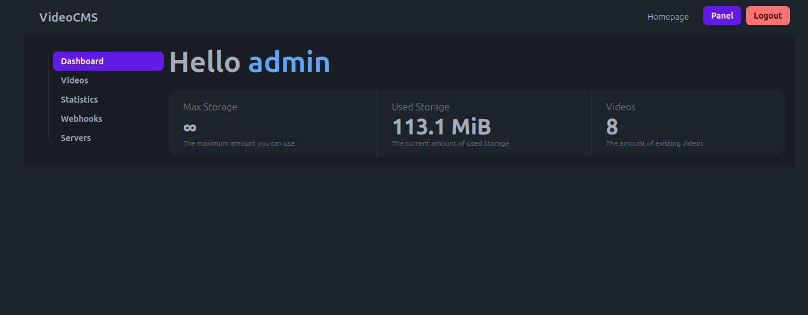
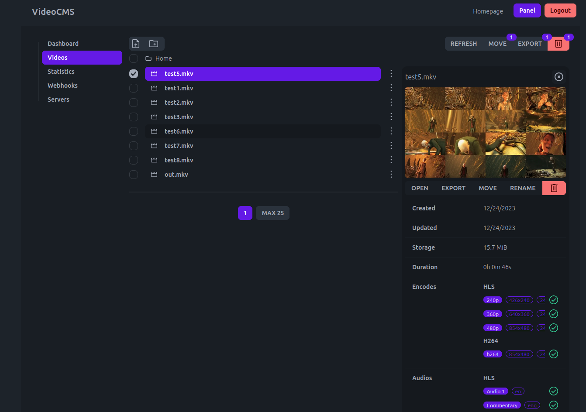
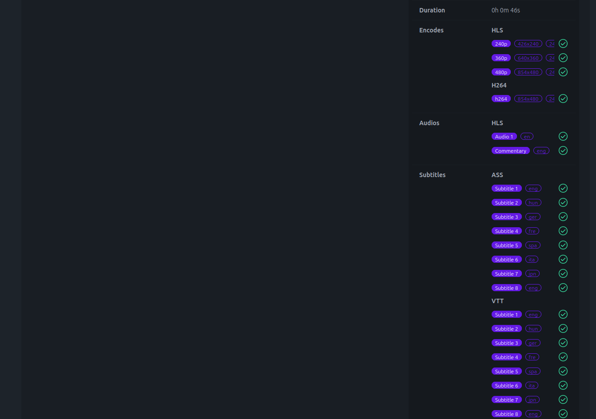
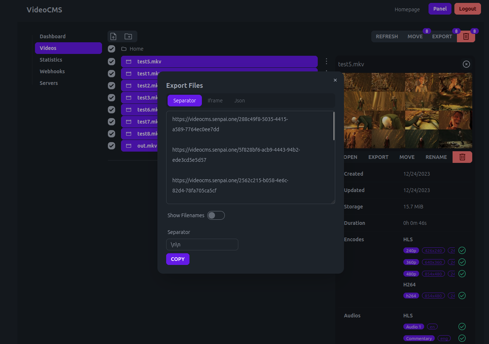
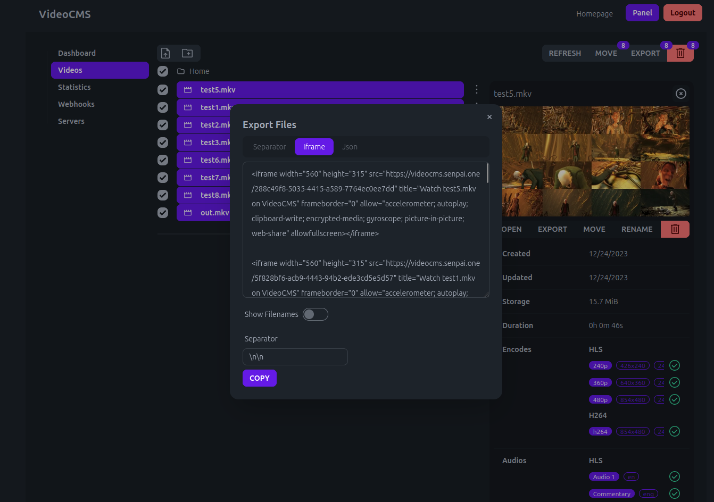
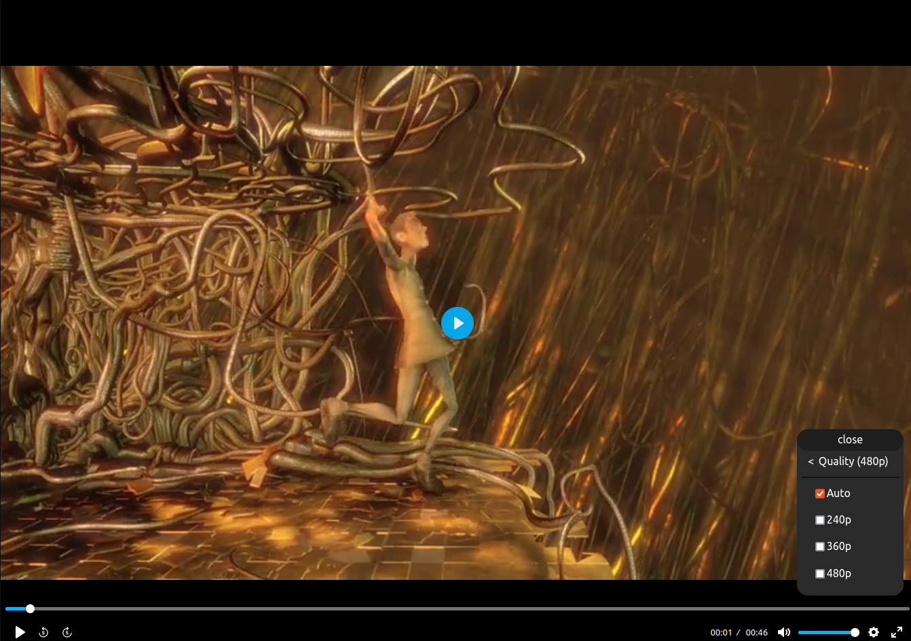
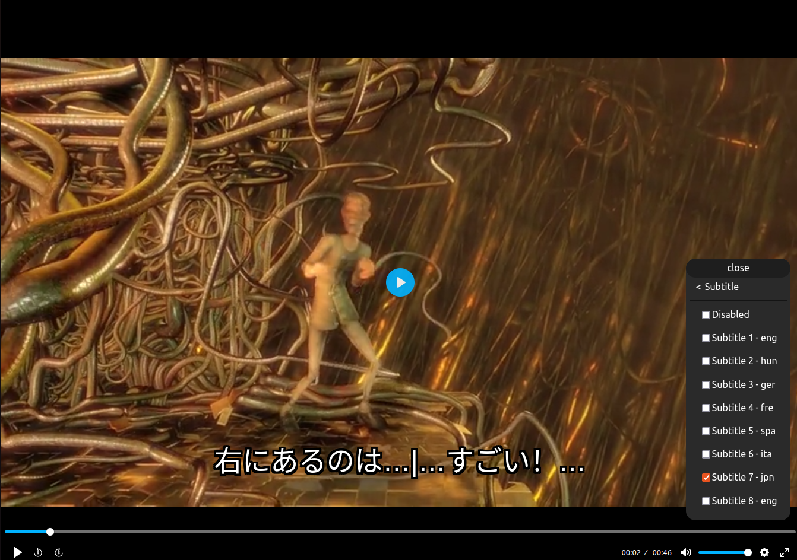
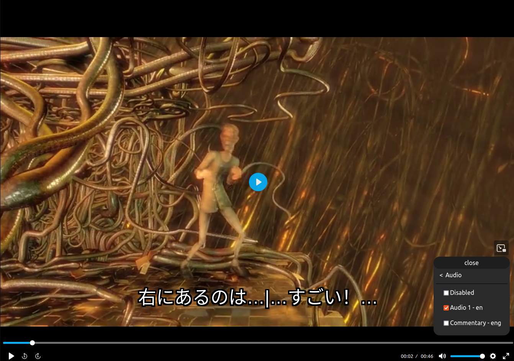
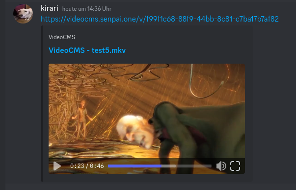

# Video-CMS

This project is a cms for hosting your videos.

## Documentation

Follow the documentation to setup VideoCMS: [https://videocms-docs.vercel.app/](https://videocms-docs.vercel.app/)

## Screenshots

### Simple Panel

### Advanced File Information

### Easy Export

### Multiple Qualities

### Multiple Subtitles

### Multiple Audio Channels

### Embed in Chats (like Discord)
