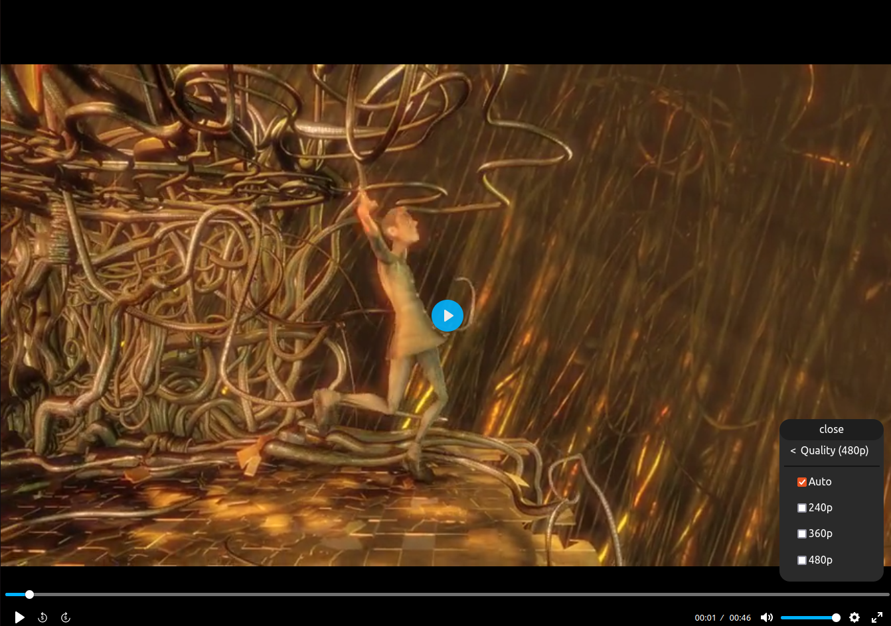
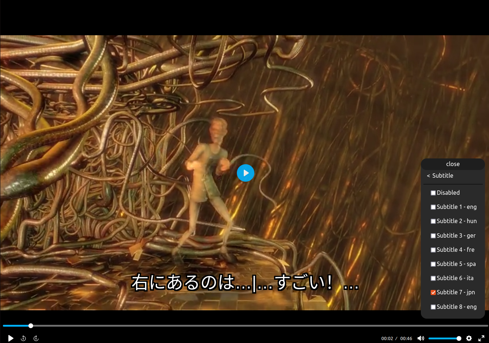
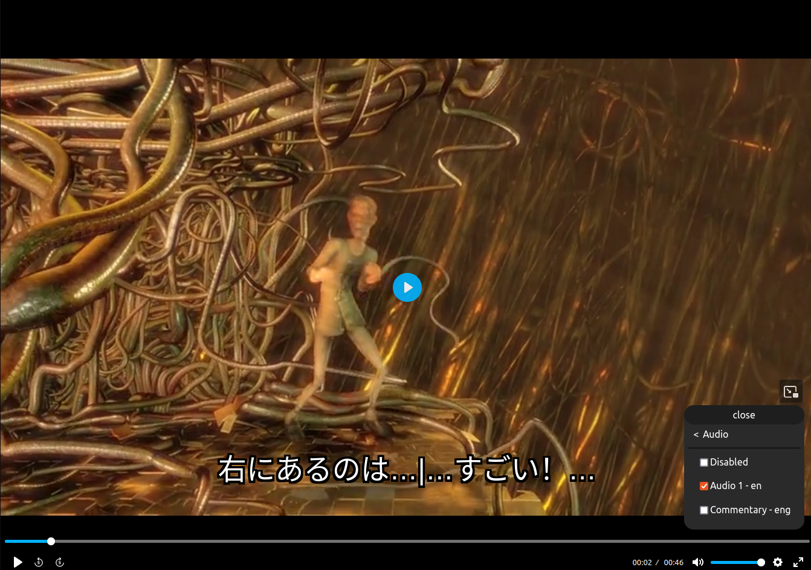
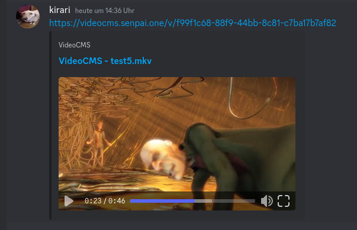

# Video-CMS 🎬

[](https://golang.org/)
[](https://www.gnu.org/licenses/agpl-3.0)
[](https://hub.docker.com/r/kirari04/videocms)

A self-hosted Content Management System for your videos. 🎞️

## Features ✨

- **🏠 Self-host:** Host VideoCMS using Docker on your own hardware.
- **✍️ Pretty Subtitles:** Subtitles are stored as softsubs in the ASS format to preserve styling and save storage.
- **⚡ HLS Multi-Quality:** Videos are converted into multiple qualities to ensure smooth playback for different connection speeds.
- **🔊 Multi-Audio:** The player supports multiple audio tracks that are not stored inside the video, saving storage space.
- **🚀 Fast Chunked Upload:** Allows the server to be behind a proxy without requiring high maximum post limits.
- **📦 Dynamic MKV Download:** The server dynamically assembles subtitles, audio tracks, and video tracks during download without re-encoding.

## Documentation 📚

Follow the documentation to setup VideoCMS: [https://videocms-docs.vercel.app/](https://videocms-docs.vercel.app/)

## Screenshots 📸

### Simple Panel


### File Information


### Easy Export


### Quality Settings


### Multiple Qualities


### Multiple Subtitles


### Multiple Audio Channels


### Embed in Chats (like Discord)


## Build 🛠️

```bash
make docker-build
```

## Docker Images

Images are published to both registries:

- `ghcr.io/kirari04/videocms`
- `kirari04/videocms`

Available tags:

- `staging`: release-candidate image built from the `staging` branch.
- `beta`: accepted beta/default release built from `master`.
- `latest`: same image as `beta` while VideoCMS is still in beta.
- `vX.Y.Z`: immutable version tag for an accepted `master` release.

## Release Flow

Development work starts on feature branches and opens pull requests into `dev`.
The `dev` branch is the active integration branch and only runs validation:
Go tests, vet/build checks, frontend generation, docs build, and Docker build
validation. It does not publish Docker images.

When `dev` is ready for release testing, open a pull request from `dev` into
`staging`. A push to `staging` publishes only the mutable `staging` Docker tag
to GHCR and Docker Hub.

When staging is accepted, open a pull request from `staging` into `master`.
The `master` branch is release-only. Every accepted push to `master` verifies
the project, resolves the next patch version, builds Linux binaries, publishes
multi-arch Docker images, creates the Git tag, creates or updates the GitHub
Release, and uploads checksums.

After the workflow changes are merged to `master`, repository maintainers can
create the `dev` and `staging` branches, set `dev` as the default branch, and
apply branch/tag protections with:

```bash
scripts/setup-release-flow.sh
```
