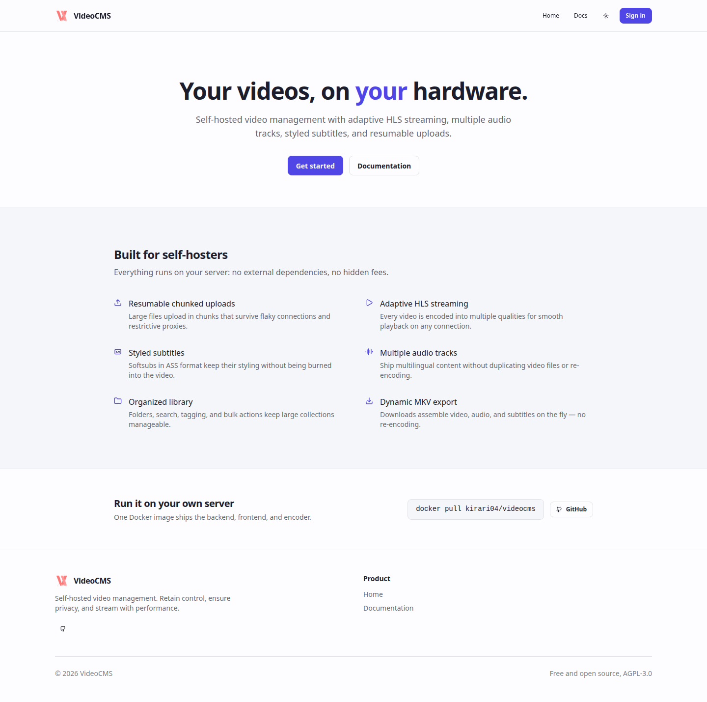
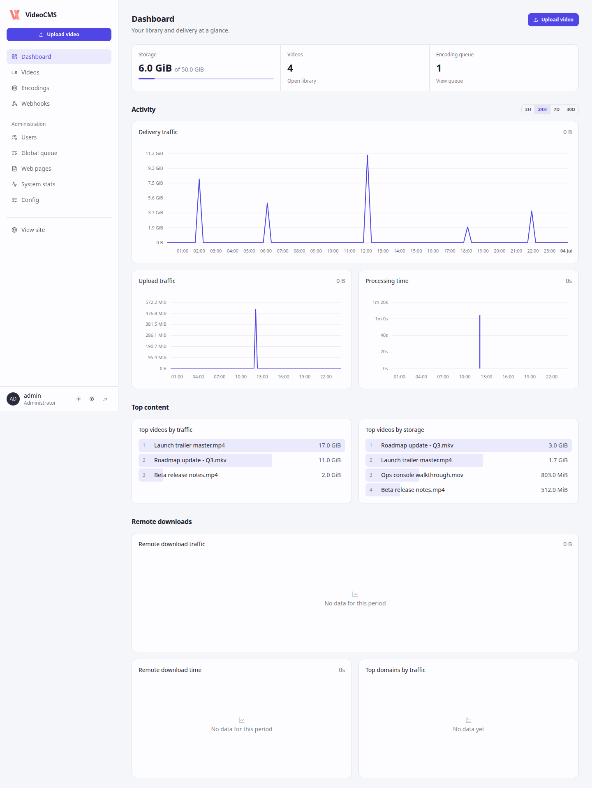
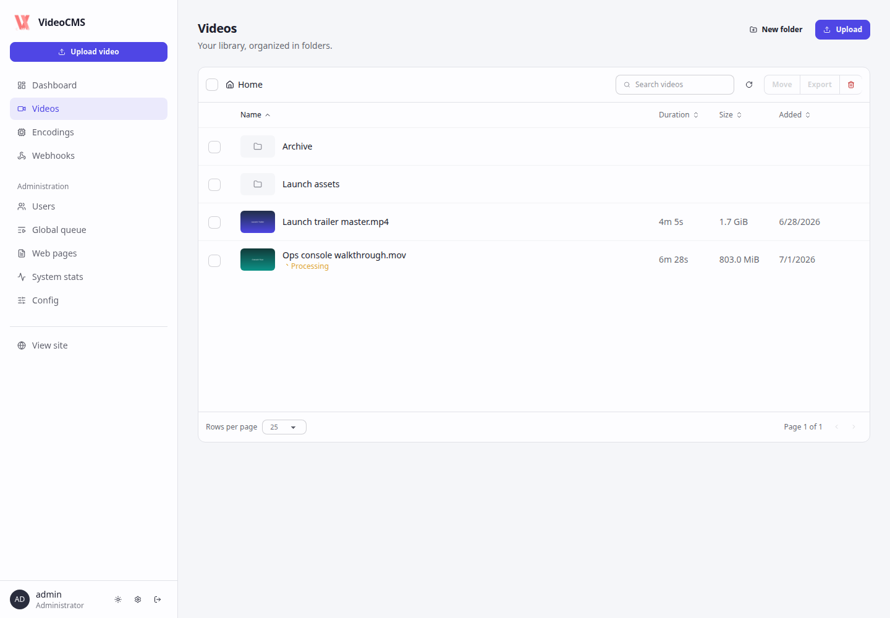
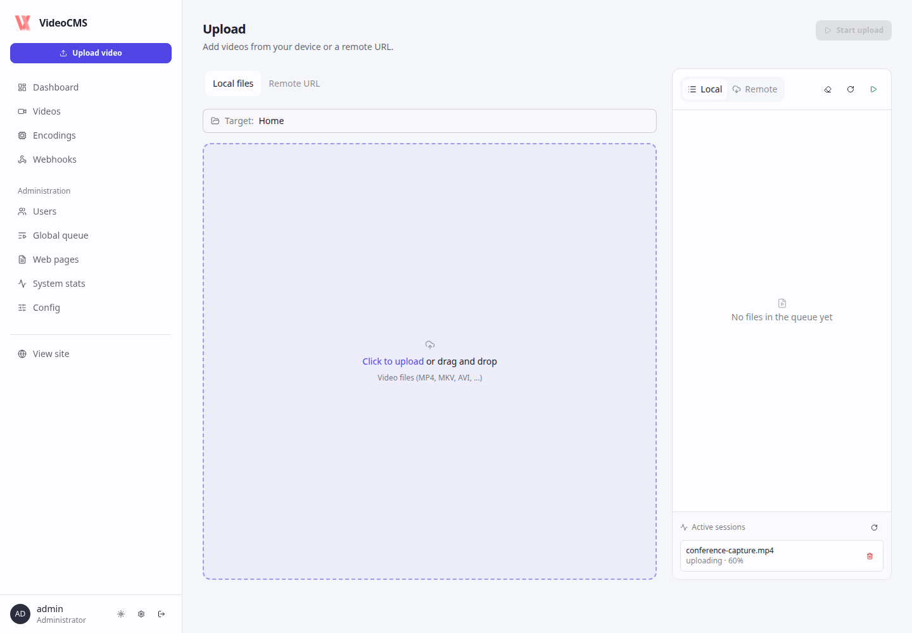
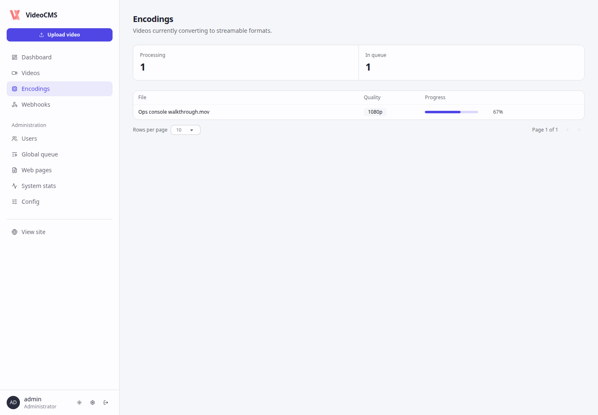
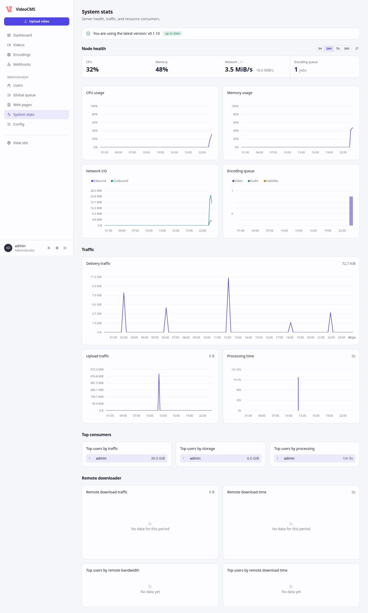
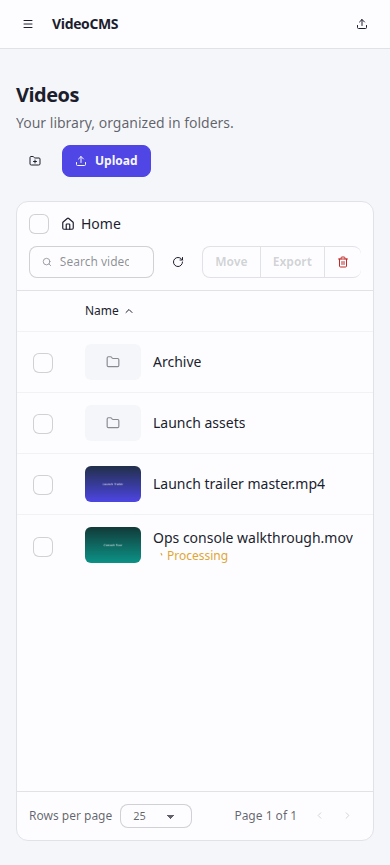

# Video-CMS 🎬

[](https://golang.org/)
[](https://www.gnu.org/licenses/agpl-3.0)
[](https://hub.docker.com/r/kirari04/videocms)

A self-hosted Content Management System for your videos. 🎞️

## Features ✨

- **🏠 Self-host:** Host VideoCMS using Docker on your own hardware.
- **✍️ Pretty Subtitles:** Subtitles are stored as softsubs in the ASS format to preserve styling and save storage.
- **⚡ HLS Multi-Quality:** Videos are converted into multiple qualities to ensure smooth playback for different connection speeds.
- **🔊 Multi-Audio:** The player supports multiple audio tracks that are not stored inside the video, saving storage space.
- **🚀 Fast Chunked Upload:** Allows the server to be behind a proxy without requiring high maximum post limits.
- **📦 Configurable Downloads:** Viewers can choose a ready quality and download MP4 with one audio track, or MKV with selectable audio and subtitle tracks. The server assembles the result without re-encoding.
- **🗄️ Storage Pools:** Keep local storage as the default or route new uploads across multiple S3-compatible mounts from the admin UI.

## Documentation 📚

Follow the documentation to setup VideoCMS: [https://videocms-docs.vercel.app/](https://videocms-docs.vercel.app/)

Storage mounts, pool routing, upgrade behavior, and reconnecting migrated buckets are described in [the storage guide](./docs/storage.md).

Durable jobs, queue controls, retries, retention, and the v2 task API are described in [the background-jobs guide](./docs/background-jobs.md).

## Screenshots 📸

### Landing


### Dashboard


### Library


### Upload Manager


### Encoding Queue


### System Stats


### Mobile Library


## Build 🛠️

```bash
make docker-build
```

## Development

Initialize the frontend and documentation submodules, then start the complete development stack:

```bash
git submodule update --init --recursive
make dev
```

Nuxt is available at `http://127.0.0.1:3000` and proxies `/api` and the backend-owned media routes to the hot-reloading Go server on port `3001`. Stopping either process shuts down the other one cleanly.

## Docker Images

Published images are available from:

- `ghcr.io/kirari04/videocms`
- `kirari04/videocms`

Available tags:

- `latest`
- `beta`
- `staging`
- `vX.Y.Z`
